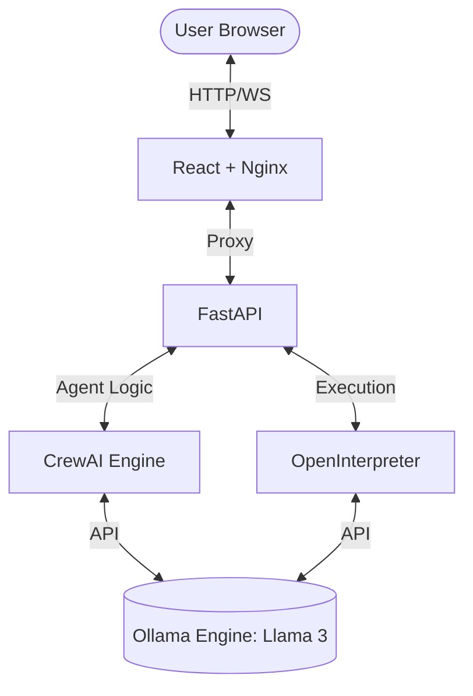

# 🤖 AI Agent Orchestrator

[](https://opensource.org/licenses/Apache-2.0)
[](https://www.docker.com/)
[](https://reactjs.org/)
[](https://fastapi.tiangolo.com/)

An advanced, full-stack platform for AI agent orchestration and autonomous task execution. Powered by **CrewAI** for multi-agent research and **OpenInterpreter** for local code execution, all running on the highly privacy-focused **Ollama (Llama 3)** model.

---

## ✨ Features

- **Multi-Agent Collaboration**: Leverage **CrewAI** to orchestrate specialists (Research Analysts, Tech Content Strategists) to solve complex workflows.
- **Autonomous Code Execution**: Integrated **OpenInterpreter** for file system tasks, data analysis, and script execution.
- **Privacy-First LLM**: Runs entirely on **Ollama** (local/private server); no API keys for OpenAI or Anthropic required.
- **Glassmorphism UI**: High-end, responsive chat interface with real-time status monitoring for backend and LLM health.
- **One-Click Deployment**: Standardized Docker orchestration and optimized deployment scripts for AWS Lightsail.

---

## 🏗️ Architecture



- **Frontend**: Vite-powered React with TypeScript and Nginx.
- **Backend**: FastAPI (Python 3.11) with Uvicorn.
- **LLM Engine**: Ollama serving Llama 3 via a REST API on Port 11434.

---

## 🚀 Quick Start (Local)

### Prerequisites
- [Docker](https://www.docker.com/get-started) & [Docker Compose](https://docs.docker.com/compose/install/)
- (Optional) [Ollama](https://ollama.com/) installed locally.

### Installation

1. **Clone the repository**:
   ```bash
   git clone https://github.com/sushantjagtap5543/ai-agent.git
   cd ai-agent
   ```

2. **Spin up the stack**:
   ```bash
   docker-compose up -d --build
   ```

3. **Initialize the Model**:
   ```bash
   docker exec -it ollama ollama pull llama3
   ```

4. **Access the App**:
   - Web: [http://localhost](http://localhost)
   - API Docs: [http://localhost:8000/docs](http://localhost:8000/docs)

---

## ☁️ Deployment on AWS Lightsail

For a production environment, we recommend an AWS Lightsail instance (Ubuntu 22.04 LTS, 8GB RAM).

### 1. Preparation
Download your instance's `.pem` key from the AWS console and save it in the root as `11111.pem`.

### 2. Auto-Deploy via SSH
Run the following from your local terminal (ensure `ssh` is in your path):

```bash
# Set permissions on Windows/Linux
chmod 400 11111.pem 

# Trigger deployment script
ssh -i 11111.pem ubuntu@<YOUR_INSTANCE_IP> "curl -s https://raw.githubusercontent.com/sushantjagtap5543/ai-agent/main/deploy.sh | bash"
```

### 3. Manual Steps
Refer to [docs/lightsail_deployment.md](./docs/lightsail_deployment.md) for a detailed manual walkthrough.

---

## 🛡️ Security & Privacy

- **No Cloud Secrets**: This platform doesn't require sharing your data with cloud LLM providers.
- **Git Hardening**: The included `.gitignore` protects your sensitive `.pem` keys and environment variables.
- **Health Indicators**: The UI includes live status checks to monitor if your backend or Ollama engine goes offline.

---

## 🛠️ Configuration

Edit `.env` (or environment variables in `docker-compose.yml`) to customize:

| Variable | Description | Default |
|----------|-------------|---------|
| `OLLAMA_HOST` | URL of the Ollama server | `http://ollama:11434` |
| `APP_PORT` | Port for the backend | `8000` |

---

## 📄 License
This project is licensed under the **Apache License 2.0** - see the [LICENSE](LICENSE) file for details.

---

## 🤝 Contributing
Contributions are welcome! If you have a feature request or bug report, please open an issue or pull request.